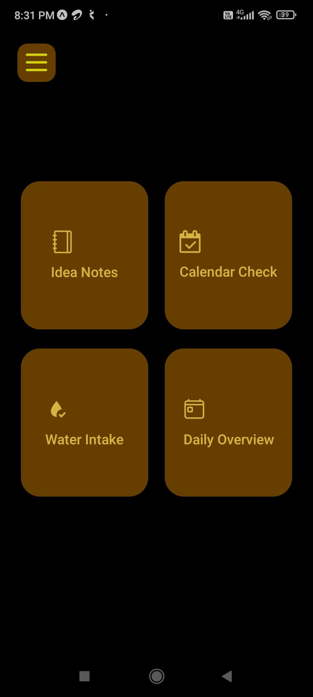
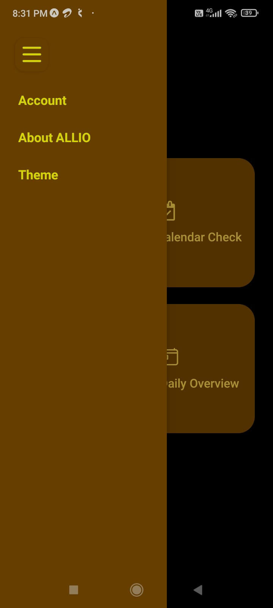
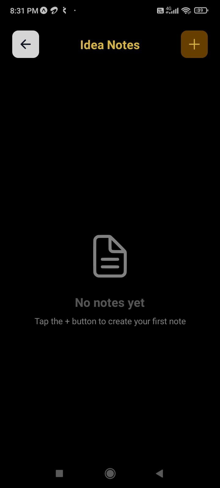
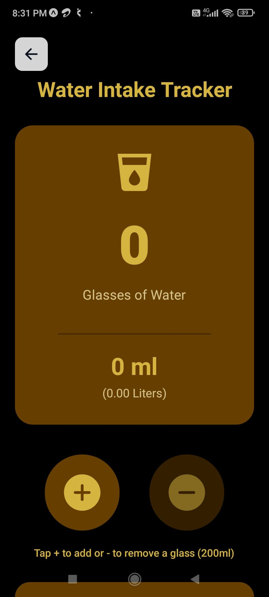
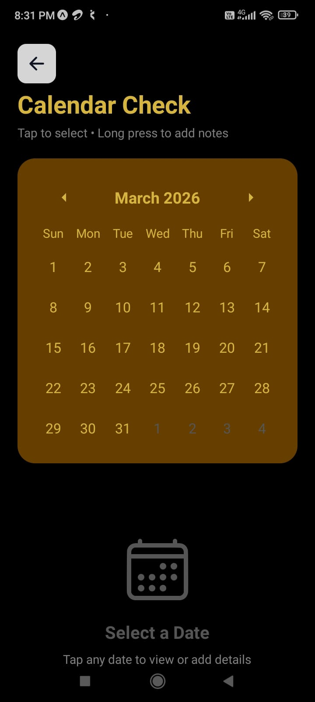
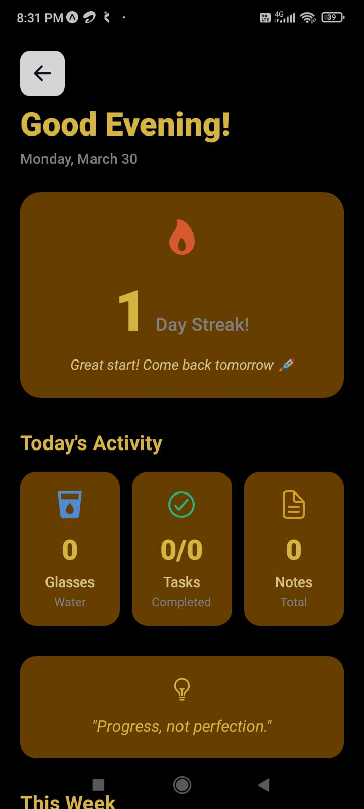

# ALLIO  
**All-in-One Productivity App**

ALLIO is a modern, minimal, and distraction-free productivity mobile application built with React Native and Expo.  
It helps users stay organized, build healthy habits, and track daily progress — all without requiring sign-up or internet connectivity.

---

## ✨ Key Highlights

- ⚡ Fast & lightweight mobile app  
- 🔐 No authentication required (privacy-first)  
- 📱 Offline-first using local storage  
- 🎨 Clean dark UI with theme customization  
- 🧠 Simple UX focused on daily productivity  

---

## 🛠️ Tech Stack

**Frontend**
- React Native
- Expo
- TypeScript

**UI & Navigation**
- React Native Paper
- Expo Router

**State & Storage**
- AsyncStorage (Local persistent storage)

---

## 📱 App Screenshots

  
  
  

  
  
  

### 📝 Idea Notes
- Quickly capture ideas and thoughts
- Create, view, and manage notes
- Stored securely using local storage

### 📅 Calendar Check
- Monthly calendar view
- Tap a date to view or add details
- Helps plan and track important days

### 💧 Water Intake Tracker
- Track daily water consumption
- Visual progress toward daily goal
- Automatic daily reset
- Encourages healthy habits

### 📊 Daily Overview
- Snapshot of daily activity
- Water intake, notes count, and tasks
- Motivational streak and quote display

---

## Availability

🚧 Google Play Store release coming soon
ALLIO will be published shortly once final testing and optimization are complete.

